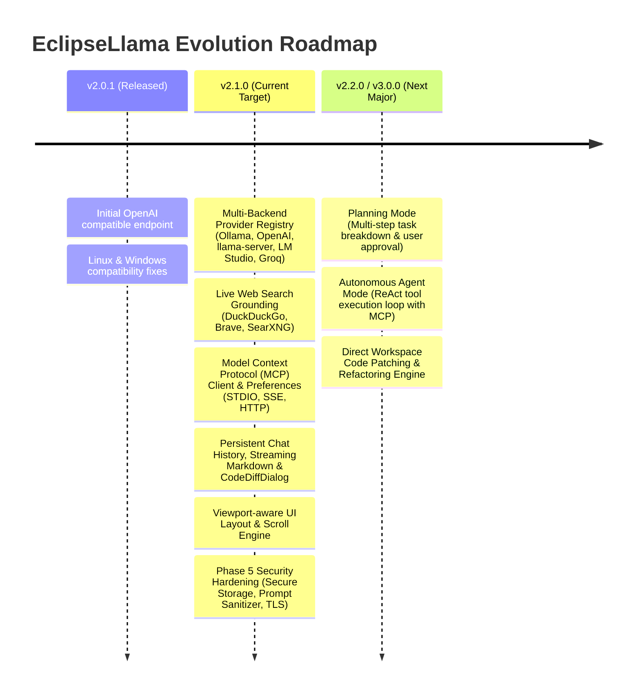

# EclipseLlama Enhancement Plan *(Version 2.0 – Active Roadmap)*

> **Status**: Phases 1–4 Completed ✅ | Phase 5 Security Hardening In Progress 🟡
> **Branch**: `develop` | **Next Target Release**: `v2.1.0` | **Repo**: `https://github.com/vijaytank/eclipsellama`
> **Methodology**: Test-driven development, zero assumptions, AST-based inspection with NakshAstraMCP.

---

## 🗺️ Roadmap & Release Strategy



---

## PART 0 – CURRENT ARCHITECTURAL STATE

### 0.1 Confirmed Integrations & Packages
```
src/com/eclipsellama/plugin/
├── api/            # LlmProvider, LlmProviderRegistry, RetryPolicy, OllamaProvider, OpenAiProvider
├── context/        # CodeContextCollector, ModelRouter, SimpleContextProvider
├── core/           # LLMClient, OllamaClient, OpenAIClient, ChatMessage
├── handlers/       # Explain, Fix, Doc, Test, Refactor, Review, Convert, OpenChat, OpenMcp, GenerateCommit
├── mcp/            # McpConnectionManager, McpProvider, McpServerConfig, Stdio/Sse/Http Connections
├── preferences/    # EclipseLlamaPreferences, McpPreferencePage, McpServerStore
├── search/         # WebSearchService, WebSearchRouter, SearchProviderRegistry, DDG/Brave/SearXNG Providers
├── storage/        # ChatHistoryStore (JSON persistence)
└── ui/
    ├── CodeDiffDialog.java
    ├── EclipseLlamaPerspective.java
    └── chat/ (ChatView, ChatStyles, MarkdownRenderer)
```

---

## PART 1 – PHASE EXECUTION TRACKER

### Phase 1 – Architectural Foundation (Provider Abstraction) ✅ COMPLETED
1. Interface `LlmProvider` and registry `LlmProviderRegistry` implemented.
2. Wrapper implementations `OllamaProvider` and `OpenAiProvider` registered.
3. Resilient `RetryPolicy` with configurable retry count and timeout backoff added.
4. Preferences for `timeout.seconds` (default 60s) and `retry.attempts` (default 3) wired.
5. Automated test suite coverage established in `api/` package.

### Phase 2 – MCP Client Integration & Probing ✅ COMPLETED
1. MCP Core connections implemented: `StdioMcpConnection`, `SseMcpConnection`, `StreamableHttpMcpConnection`.
2. `McpProvider` registered dynamically inside `LlmProviderRegistry`.
3. Preferences page `McpPreferencePage` created under *Preferences → EclipseLlama → MCP Servers* with real-time connection testing.
4. Probing status block builder wired to chat prompts.

### Phase 3 – Web Search Grounding ✅ COMPLETED
1. `SearchProviderRegistry` with pluggable providers:
   - `BuiltInSearchProvider` / `DuckDuckGoSearchProvider` (zero-config, HTML parser).
   - `BraveSearchProvider` (fast privacy API).
   - `SearXNGSearchProvider` (self-hosted metasearch).
2. Intelligent `WebSearchRouter` with 4 modes (`Smart`, `Ask`, `Always`, `Off`).
3. Ephemeral pre-prompt injection without mutating persistent chat history.
4. Collapsible Web Search Context Panel in `ChatView`.

### Phase 4 – Features, Modern UI & UX Hardening ✅ COMPLETED
1. **Persistent History**: `ChatHistoryStore` saves and restores conversations across Eclipse restarts.
2. **Context-Aware Prompts**: `CodeContextCollector` extracts class, method, and package context.
3. **Interactive Diff Dialog**: `CodeDiffDialog` leveraging Eclipse `CompareUI` for AI code fixes.
4. **New Handlers**: `RefactorCodeHandler`, `ReviewCodeHandler`, `ConvertCodeHandler`.
5. **Modern Chat UI**: Streaming markdown rendering, hero welcome card with interactive quick prompt chips, one-click "Copy Code" & "Insert in Editor" buttons.
6. **Viewport-Aware Scroll Engine**:
   - Fixed word-wrap height underestimation with dynamic width calculation (`refreshMinSize()`).
   - Synchronized auto-scroll with `scrolledComposite.getMinHeight()`.
   - Cleaned duplicate bottom quick action buttons to streamline UI.
   - Reused singleton HTTP client in background search pipelines.

---

## PART 2 – PENDING IMPLEMENTATION PHASES

### Phase 5 – Security Hardening 🟡 (Current Target for v2.1.0 Release)

1. **Secure Storage Migration (`SecurePrefsStore`)**
   - Wrap Eclipse `org.eclipse.equinox.security.storage.ISecurePreferences`.
   - Automatically migrate plain-text API keys from `config.properties` into encrypted secure storage on first startup.
   - Support secure retrieval for OpenAI API keys, Brave Search keys, and MCP tokens.

2. **Prompt Injection & Sanitization (`PromptSanitizer`)**
   - Add `PromptSanitizer.sanitizeUserInput(String)` to strip zero-width characters and neutralize prompt override injections.
   - Run input through sanitizer in all code action handlers before LLM transmission.

3. **MCP Bearer Authentication**
   - Add `bearerToken` storage to `McpServerConfig`.
   - Inject `Authorization: Bearer <token>` in `SseMcpConnection` and `StreamableHttpMcpConnection`.

4. **HTTPS / TLS Configuration**
   - Preference for enforcing TLS and custom truststore paths for enterprise deployments.

---

### Phase 6 – Quality Gates & Release Packaging 🔵 (v2.1.0 Gate)

1. **Test Suite Verification**: Execute all JUnit test suites (currently 82+ passing tests).
2. **PDE Build & Update Site**: Generate plugin update site jars for `v2.1.0`.
3. **OSGi Manifest Validation**: Verify all exported packages and required bundles (`org.eclipse.compare`, `org.eclipse.equinox.security`).

---

### Phase 7 – Planning Mode & Autonomous Agent Mode 🚀 (Target: v2.2.0 / v3.0.0)

1. **Planning Mode UI & Workflow**:
   - Specialized prompt builder that explores workspace context and produces a structured step-by-step implementation plan.
   - Plan preview card in `ChatView` with **[Approve & Execute]** and **[Refine Plan]** interactive controls.

2. **Autonomous Tool-Calling Loop (ReAct Engine)**:
   - Tool schema serialization (JSON Schema format) for registered MCP and IDE workspace tools.
   - Parser in `OllamaClient` / `OpenAIClient` to detect structured `tool_calls`.
   - Multi-turn execution loop: Intercept tool call -> Execute via `McpConnectionManager` -> Inject tool result -> Request next action -> Complete task.

3. **Direct Workspace Patching**:
   - Integration with Eclipse JDT / Workspace API to apply multi-file edits and preview AST diffs safely before committing.

---

## PART 3 – VERIFICATION & QUALITY GATES

| Gate | Requirement | Status |
| :--- | :--- | :--- |
| **Compilation** | Java 21 PDE build with zero warnings | ✅ Passed |
| **Unit Tests** | All 82 JUnit 4 tests passing | ✅ 82/82 OK |
| **Scroll / Layout** | Resizing, streaming, and large message scrolling | ✅ Verified |
| **Security** | Secure storage migration & prompt sanitizer | 🟡 Phase 5 pending |
| **Tool Execution** | ReAct autonomous agent loop | 🚀 Phase 7 planned |